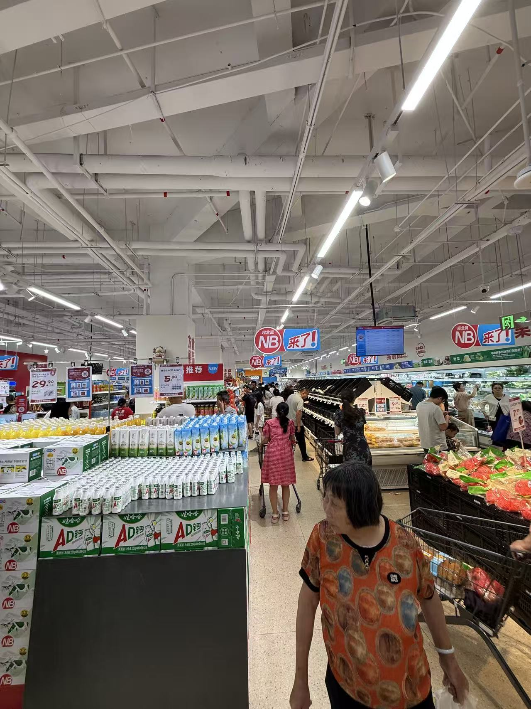

# 电商行业研究报告

> 电商行业关键围绕：购物意图、消费者信任、电商平台与各方之间的链主博弈
> 一些专业指标词：
> - **GMV**（Gross Merchandise Volume）：交易总额
> - **Take Rate**：平台从GMV中抽取的比例
> - **CAC**（Customer Acquisition Cost）：获客成本
> - **LTV**（Lifetime Value）：用户生命周期价值，LTV/CAC是业务健康度核心指标
> - **ROAS**（Return on Ad Spend）：广告投入回报
> - **ACOS**（Amazon Cost of Sale）：亚马逊广告支出占销售额比例
> - **CVR**（Conversion Rate）：转化率
> - **AOV**（Average Order Value）：平均订单价值

### 七个核心判断

1. **电商的本质是"购物意图的拍卖与匹配"**

意图是稀缺资源，谁控制意图入口，谁就是链主。电商平台的真正利润核心是广告（拍卖意图），不是零售差价。

1. **行业主导矛盾经历了三次切换**

买不到（物理可得性）→ 找不到（信息匹配）→ 不敢买（信任缺失）。每次切换都重塑了链主。当前正处在第四次切换的前夜——AI重构意图入口。

1. **ROE 差距的真正根源是净利润率，不是资产结构**

亚马逊高 ROE 来自广告（57% 利润率）与 AWS（27%）对零售薄利的对冲。看到一家"重资产"公司 ROE 高，必然有隐藏的广告/SaaS业务在输血。

1. **流量越来越贵是永久趋势，不会自我修正**

三大驱动因素叠加（人口见顶 30% + 注意力分流 40% + 平台主动提价 30%），且都没有自然纠偏机制。商家唯一出路是建立自然流量护城河，而非寻找"更便宜的流量"。

1. **内容电商对 AI 冲击有结构性免疫力**

AI 主要替代"人找货"（搜索），不替代"货找人"（推荐）。这导致一个反直觉结论：在 AI 时代，抖音/小红书反而比亚马逊/淘宝更安全。

1. **信任层 S 曲线进入饱和期**

KOL 信任度下滑、退货率系统性上升、假评论成为系统性问题——这些证据指向 2024-2026 年可能出现信任机制的拐点，下一个解法在 AI 个性化与会员制之间。

1. **Temu 模式在 2025 年遭遇结构性冲击**

De minimis 豁免在 2025 年 8 月对全球终结后，Temu 美国 DAU 较 3 月下跌 52%，美国广告投放下降 95%。SHEIN 的韧性高于 Temu，因前者的护城河（"设计数据+快反"）可跨地理迁移，后者的护城河（"中国工厂低价直发"）被关税精准打击。

### 报告结构

第一部分回答"电商是什么生意"。第二、三、四部分逐层拆解：行业基础盘 → 流量层经济学 → 转化与信任层。第五部分分析跨界博弈（电商 vs 社交媒体/品牌/物流）。第六部分聚焦两个结构性变量：AI 重构与跨境关税。第七部分给出战略含义。附录提供持续追踪的指标体系。

---

## 第一部分：行业本质——电商生意的底层定义

### 1.1 三层定义框架

#### 第一层（机制层）：意图的拍卖与匹配

> 电商是一门"将用户购物意图转化为商业价值"的生意。意图是稀缺资源，谁控制意图入口，谁就是链主。

这个定义抓住了所有电商形态的共通点。无论是搜索电商、内容电商、直播电商还是 AI 电商，核心都是把用户的某种"想买"转化为"已买"，并对这个转化过程的某个环节收税。

#### 第二层（利润机制）：广告是真正的利润核心

> 电商平台的利润核心永远是"广告"（拍卖购物意图），而不是"零售差价"。所有看起来靠零售赚钱的公司，都有一个隐藏的广告/SaaS/云业务在输血。

零售业务毛利率通常仅 8-15%，而广告业务毛利率高达 70-80%。看亚马逊 2024 年的财务结构：广告收入 562 亿美元，同比增长 18%（2025 年全年 686 亿美元，增长 22%），利润率约 57%——这才是亚马逊真正的利润引擎，而非 1P 自营零售。

#### 第三层（分析工具）：DuPont 链条诊断

> ROE = 净利润率 × 资产周转率 × 杠杆。当 Take Rate 相似但利润率差距大→查成本结构；当成本结构相同但利润率不同→查资产结构（DuPont 分析）。异常值都指向真正的竞争差异。

这个工具用于对比四家公司的真实差异。当一家"重资产"公司 ROE 意外地高，必然有隐藏的高利润业务；当一家平台公司 ROE 下降，先看净利润率（成本端），再看资产增加（是否重资产投入）。

### 1.2 历史中的链主演替

中国城市用户群的电商主导矛盾经历了三次切换。每次切换都重塑了链主，也重塑了产业链中价值攫取的方式。

| 时期 | 主导矛盾 | 链主 | 价值攫取方式 |
| --- | --- | --- | --- |
| 2000–2008 | 物理限制（买不到） | 电商平台（淘宝/亚马逊） | 佣金：撮合买卖双方 |
| 2008–2016 | 信息匹配（找不到） | 搜索引擎 + 平台广告系统 | 竞价广告：卖搜索意图 |
| 2016–2024 | 信任缺失（不敢买） | KOL/主播 + 平台信用体系 | 坑位费 + 带货佣金 + 品牌广告 |
| 2024–？ | 意图分散（AI 重构入口） | 待定（AI 平台?现有平台?） | 待定 |

需要补充的关键观察：这种主导矛盾切换是在"同一用户群"内发生的。下沉市场、老年群体可能处于不同的主导层——这意味着平台的战略机会往往出现在"找到一个被既有主导层高估的新用户群体"（如拼多多发现下沉市场的"买不到"仍未解决，抖音发现内容种草人群仍处于"找不到"状态）。

---

## 第二部分：行业规模与竞争格局

### 2.1 中美市场基础盘（2024）

#### 中国市场：平台间份额格局已发生重大变化

| 平台 | 2024 年 GMV | 增速 | 口径备注 |
| --- | --- | --- | --- |
| 淘天集团 | 约 8 万亿元 | +5–8% | 含淘宝 C2C，实际品牌电商口径约 3-4 万亿 |
| 拼多多 | 约 5.2 万亿元 | 14.8 | 未公开披露，36 氪估算 |
| 抖音电商 | 约 3.5 万亿元 | 0.3 | 2025 目标 4.2 万亿；货架场景占比已超 40% |
| 京东 | 约 3.5–4 万亿元 | 0.05 | 增长放缓，广告变现能力弱 |

**关键观察**：抖音电商 2024 年 GMV 已超越京东，成为行业第三。但抖音增速从 2022 年的 320% 一路下滑到 2023 年的 80%、2024 年的 30%，标志着内容电商野蛮生长期结束。同时，抖音店播 GMV 已连续 2 年超越达人直播——这意味着头部主播红利在退潮，商家自播成为新主力。

#### 美国市场：亚马逊与广告业务的强绑定

| 指标 | 2023 | 2024 | 2025 |
| --- | --- | --- | --- |
| 亚马逊广告收入 | 468 亿美元 | 562 亿美元 | 686 亿美元 |
| 年增速 | — | 0.18 | 0.22 |
| 利润率（估） | ~55% | ~57% | ~58% |
| 占亚马逊营业利润比 | 高 | 约 50%+ | 约 55%+（估） |

亚马逊广告业务在 2024-2025 年保持加速。但需警惕：Q4 2024 的 18% 增速已较 2023 年同期的 26% 出现减速；这反映了"非常大的基数"效应，以及电商广告主对 ROI 的更精细评估。

### 2.2 四大平台财务体检

#### Take Rate 拆解：广告变现效率的代际差距

| 平台 | 广告收入（年化） | GMV 基数 | 广告 Take Rate |
| --- | --- | --- | --- |
| 亚马逊 | 约 686 亿美元（2025） | 约 8000 亿美元 GMV（估） | 约 7.8–8.5% |
| 拼多多 | 约 2476 亿元 | 约 5.2 万亿元 | 约 4.8–5.6% |
| 阿里（CMR） | 约 310 亿元 | 约 8 万亿元 | 约 3.9%（若仅计天猫则 5-7%） |
| 京东 | 约 300 亿元 | 约 4 万亿元 | 约 0.8%（广告未成规模） |

亚马逊广告 Take Rate 是阿里的 2 倍，原因分解如下（数字为占差距的估算比重）：

**单次意图货币化效率（约 50%）**：亚马逊用户搜索时购买意图明确，全球品牌竞价激烈，CPC \$2-5；淘宝有大量白牌商品拉低竞价基准，CPC ¥0.5-2（约 \$0.07-0.28）。本质差异：美国品牌竞争更激烈，中国白牌占比更高。

**广告库存结构（约 25%）**：亚马逊广告主要集中在"临门一脚"的购买决策阶段（Sponsored Products）；阿里更多覆盖"浏览发现"阶段，后者每次曝光的货币价值更低。

**竞争压力分散（约 15%）**：在中国，商家广告预算被千川（抖音）分流；在美国，Meta 和 Google 的流量最终仍流入亚马逊，不构成直接竞争。

**GMV 口径（约 10%）**：阿里 8 万亿包含闲鱼 C2C、B2B 等低商业化率部分。仅看天猫，Take Rate 可达 5-7%。

#### ROE 差距的真正根源

一个原始的假设是："平台模式天然高 ROE，因为资产不在表上。"但数据修正了这个判断。

> 平台 vs 自营的 ROE 差距，主要根源是净利润率差异（广告业务毛利率 80%+ vs 零售业务毛利率 8%），资产结构是次要因素。

亚马逊为何 ROE 高？不是因为资产轻，而是因为广告 + AWS（均为轻资产高利润）对冲了零售（重资产薄利）。这验证了一个一般规律：

- **规律 1**：当一家"重资产"公司 ROE 意外地高，必然有一个隐藏的广告/平台/SaaS 业务在输血。
- **规律 2**："平台模式必然高 ROE"是错误的——只有当平台广告业务成规模时才高 ROE。早期拼多多、京东未建立广告核心时 ROE 同样低。

#### 京东的结构性缺陷

京东 ROE 长期低于阿里和拼多多，根本原因不是"自营重资产"，而是"未建立广告变现体系"。京东的 3P 商家数量约 50 万，远少于阿里的数百万，导致广告拍卖池规模小，广告收入无法成为利润支柱。这是为什么京东在 2024-2025 年战略上加大对第三方商家招商力度的根本动机。

---

## 第三部分：流量层经济学

流量是电商的命脉，也是平台与商家博弈的主战场。本节从三种流量的结构性变化入手，拆解"流量越来越贵"的真实驱动，并量化拍卖机制如何决定商家生死。

### 3.1 三种流量的结构性变化

#### 自然流量：正在被平台主动压缩的稀缺资源

以淘宝为例，商家自然流量占 GMV 来源的比例呈现持续下降：

| 年份 | 自然流量占比 | 付费流量占比 |
| --- | --- | --- |
| 2015 | 60–70% | 30–40% |
| 2018 | 50–55% | 45–50% |
| 2021 | 40–45% | 55–60% |
| 2024 | 30–35% | 65–70% |

**机制**：平台故意压缩自然流量来增加广告收入。如果给商家更多自然流量→商家不需要买广告→平台广告收入减少；如果压缩自然流量→商家必须买广告才能获得流量→平台广告收入增加。

谁还有大量自然流量？

- 强品牌（消费者主动搜索品牌名）
- 老爆款（销量积累形成自然排名）
- 优质内容（抖音/小红书算法主动推送）
- 私域流量

#### 付费流量：CPC 在涨，ROAS 在跌

2024-2025 年主要平台 CPC 基准（各品类差异极大）：

| 平台 / 品类 | 平均 CPC | ROAS 基准 | CAC 估算 |
| --- | --- | --- | --- |
| 淘宝直通车 / 女装 | ¥1.5–4 | 3–5x | ¥80–200 |
| 淘宝直通车 / 3C 数码 | ¥3–8 | 4–8x | ¥200–500 |
| 淘宝直通车 / 美妆护肤 | ¥2–6 | 3–6x | ¥150–400 |
| 抖音千川 / 女装 | ¥0.8–2.5 | 2–4x | ¥60–150 |
| 抖音千川 / 美妆 | ¥1.5–4 | 2.5–5x | ¥100–250 |
| 拼多多推广 / 日用品 | ¥0.3–1 | 3–6x | ¥30–100 |
| 亚马逊 PPC / Electronics | $0.8–2.5 | 3–6x | $40–120 |
| 亚马逊 PPC / Beauty | $0.5–1.8 | 4–8x | $30–80 |

**关键洞察**：抖音千川 CPC 系统性低于淘宝直通车，但 ROAS 也更低——因为抖音用户购买意图低于搜索用户。拼多多 CPC 最低，是因为平台刻意压低广告门槛吸引白牌商家，但意味着平台单价收益低，靠量弥补。

商家容易忽视的隐藏成本：

- **内容制作成本**：抖音广告如果自然内容质量差，砸钱投千川也低效
- **退货处理成本**：抖音退货率 30-45% 远高于淘宝 15-25%
- **账户运维成本**：专业 SEM 运营月薪 ¥8,000-20,000，中小商家无法承担

#### 私域流量：护城河还是"延迟付费"？

私域流量的真实经济学（美妆品牌行业估算）：

| 指标 | 公域（淘宝付费） | 私域（企微/公众号） |
| --- | --- | --- |
| 触达成本 | ¥0.5–2 / 次曝光 | ¥0.1–0.3 / 次推送 |
| 转化率 | 1–3% | 5–15% |
| 客单价 | ¥150–200 | ¥200–300 |
| 复购间隔 | 3–6 个月 | 1–2 个月 |
| 年 LTV 估算 | ¥300–500 / 用户 | ¥800–1500 / 用户 |

私域将用户 LTV 从 ¥300-500 拉升到 ¥800-1500，看起来是绝对的护城河。但需要看清完整成本结构：

> 如果公域 CAC = ¥200（首购成本），进私域的转化率 = 20%（20% 首购用户愿意加微信），则每个私域用户的真实获取成本 = ¥200 ÷ 20% = ¥1000。在这个用户身上，额外的复购 LTV 需要超过 ¥1000 才值得。

**结论**：私域是"留存工具"，不是"获客工具"。永远需要用公域"喂养"私域。没有公域获客渠道的品牌，私域会自然萎缩。私域真正解决"流量贵"问题的前提是：品类有高复购属性 + 首购到私域转化率高 + 持续运营能力。

### 3.2 "流量越来越贵"的真实驱动

"流量越来越贵"是行业共识，但驱动因素长期存在争议。综合三个解释框架的证据：

| 驱动因素 | 对 CPM 上涨的贡献 | 是否持续 | 可被平台控制？ |
| --- | --- | --- | --- |
| 人口红利见顶 | 约 30% | 永久性 | 否 |
| 注意力被分流到短视频 | 约 40% | 取决于抖音增长 | 部分（引入内容生态） |
| 平台主动调高 Take Rate | 约 30% | 周期性 | 完全可控 |

最有力的证据来自阿里巴巴的 CMR（广告收入）增速 vs GMV 增速对比：

| 财年 | CMR 绝对值 | CMR 增速 | GMV 增速 | Take Rate 变化 | 数据来源 |
| --- | --- | --- | --- | --- | --- |
| FY2020 | 约2,497亿 | 0.22 | 0.19 | 基本同步 | 研报估算 ～ |
| FY2021 | 3,045亿 | 0.22 | 0.17 | CMR 明显跑赢 GMV | 年报原始值 ✓ |
| FY2022 | 3,150亿 | 0.035 | 0.19 | GMV 增但 CMR 放缓 | 年报原始值 ✓ |
| FY2023 | 2,904亿 | -7.80% | -1~+2% | 主动让利 / 竞争压力 | 年报原始值 ✓ |
| FY2024 | 约3,040亿 | 0.043 | 高个位数 | 复苏，货币化率回升 | 研报披露 ～ |
| FY2025 | 约2,938亿 | +8%（各季累加） | 高个位数 | 货币化率大幅提升 | 财报电话会 ～ |

2021 年和 2024 年的 CMR 增速显著高于 GMV 增速，说明平台确实在主动提高广告 Take Rate。当平台面临竞争压力（2022-2023 年抖音冲击、拼多多崛起）时让利，当竞争稳定后重新提价——这是周期性博弈。

#### 市场失灵：为什么流量贵不会自我修正？

常规经济学预期：某要素价格上涨，使用方会寻找替代品，价格回归均衡。但流量市场不遵循这一规律，原因有三：

**原因 1——没有好的替代品**：付费贵了用自然流量？但自然流量被平台故意压缩；用私域替代？私域只是留存工具不是获客工具；自建品牌减少广告依赖？需要数年时间和巨额投资。

**原因 2——平台是卖方垄断**：每个品类在每个平台上，用户就在那里。品牌商不买淘宝广告，就损失淘宝用户触达。这不像一般商品市场，流量卖方不可替代。

**原因 3——囚徒困境结构**：理性的单个商家选择"继续投广告"，集体结果是广告价格持续上涨，所有人损失。这是广告市场的"公地悲剧"——理性个体行为导致集体次优结果，平台是最大受益者。

### 3.3 拍卖机制与商家生死线

拍卖机制不只是平台的盈利工具，它从结构上决定了哪些商家能活下去。以服装类目为例的盈亏平衡测算：

> 假设客单价 ¥150，毛利率 30%（毛利 ¥45/单），运营成本（客服+售后+退货）¥15/单。可用于广告预算：¥45 - ¥15 = ¥30/单。广告 ROI 盈亏平衡：广告花费 / 销售额 ≤ ¥30/¥150 = 20%，即 ROAS ≥ 5x。

如果类目竞争激烈，平均 ROAS 降到 4x：每卖出 ¥150 商品需花 ¥37.5 广告费，毛利 ¥45 - 运营 ¥15 - 广告 ¥37.5 = **亏损 ¥7.5**。这意味着大多数中等规模商家已经亏损。

谁能在 ROAS 下行时存活？

| 商家类型 | 生存策略 | 可行性 |
| --- | --- | --- |
| 高利润率商品（毛利 >60%） | 承受更低 ROAS | 高（美妆、珠宝） |
| 超大规模商家 | 质量分高，CPC 低 | 高（马太效应受益） |
| 私域复购为主 | 少依赖付费流量 | 中（需品牌积累） |
| 白牌低价商家 | 以价格换自然流量 | 低（平台压缩自然流量） |
| 独特供应链商家 | 成本优势 → 接受低 ROAS | 中（难持续） |

**行业结构后果**：广告拍卖机制在长期内淘汰中等规模的中利润率商家，留下两类——高利润率品牌商家（能承受高广告费）和超大规模白牌商家（靠量摊薄）。这解释了为什么电商生态不断走向"品牌两极化"：大品牌 + 超低价白牌，中间商家消失。

---

## 第四部分：转化与信任层

### 4.1 搜索电商 vs 内容电商的漏斗精算

搜索电商和内容电商不是同一个生意的两个版本，而是结构不同的两套漏斗。

| 指标 | 搜索电商（淘宝/亚马逊） | 内容电商（抖音） |
| --- | --- | --- |
| 起点用户购买意图 | 明确（主动搜索） | 无（被动消费内容） |
| 展示 → 成单转化率 | 0.5–2% | 0.15–1.2% |
| 退货率 | 15–25% | 30–45% |
| 客单价（服装类） | ¥150–300 | ¥50–150 |
| 复购率（90 天内） | 约 25–35% | 约 15–20% |

#### 为什么抖音客单价系统性低于淘宝？

**直接原因**：触发购买的场景不同 → 决策深度不同 → 愿意支付的价格不同。

淘宝搜索：用户已经想买 → 主动比较 → 选择最适合的（价格接受度高）。

抖音刷视频：用户没想买 → 被内容打动 → 冲动下单。价格越高，心理障碍越大（"我真的需要这个 ¥300 的东西吗？"），因此抖音系统性偏向低价冲动品。

**品类结构验证这一点**（2024 估算）：

| 品类 | 淘宝占比 | 抖音占比 | 差异原因 |
| --- | --- | --- | --- |
| 服装 | 30% | 35% | 视觉展示效果好 |
| 食品/零食 | 10% | 20% | 冲动消费，低单价 |
| 3C 数码 | 15% | 5% | 决策复杂，需主动比较 |
| 家居大件 | 15% | 5% | 高单价，需理性决策 |
| 美妆个护 | 20% | 25% | 两者都强 |

**结论**：抖音品类结构天然偏向"冲动、低价、视觉展示型"商品。3C、家居大件（理性决策类）会长期留在搜索电商。这不是算法选择，而是内容电商的本质属性。

#### 退货率的成本分摊

退货率对平台的盈利影响有限——平台只承担小部分成本（系统/客服，约 ¥2-5/笔），商家承担大部分（逆向物流 ¥5-15/笔 + 商品重新上架）。这是平台倾向于不严格控制退货率，而商家持续抱怨"抖音难做"的结构性根源。

### 4.2 信任层的 S 曲线衰退

#### 当前信任机制的边际收益递减证据

**证据 1：退货率系统性上升**

| 平台 / 品类 | 2019 退货率 | 2023 退货率 | 趋势 |
| --- | --- | --- | --- |
| 抖音电商（服装） | N/A | 30-45% | 建立中即高 |
| 淘宝（服装） | 约 15% | 25-30% | ↑ |
| 亚马逊（全品类） | 约 12% | 18-22% | ↑ |
| 京东（3C 电子） | 约 3% | 约 5% | 略升 |

退货率上升意味着：用户在购买时的信任是"错误的信任"——他们买了但不满意。这正是信任机制边际失效的信号。

**证据 2：KOL 信任度下滑**

头部 KOL（粉丝 1000 万+）的"种草转化率"从 2020 年的 3-5% 降至 2023 年的 1-2%。"无效种草"比例上升。

**证据 3：假评论成为系统性问题**

亚马逊 2023 年删除约 2 亿条虚假评论。国内有专业"测评机构"实为付费好评组织。用户开始质疑评分：4.8 vs 4.6 的差距是否真有意义？

**证据 4：头部主播塌房风波**

2024 年小杨哥、东北雨姐等多个头部达人出现舆情事件，头部达人对大促贡献下降至抖音 GMV 的约 9%（百万粉以上口径），货架场景占比反超至 40%+。这是信任主导层向"平台担保"迁移的信号。

#### 下一层主导矛盾的四个候选场景

##### 场景 1（中-高概率）：AI 个性化——"算法代你验证"

**机制**：AI Agent 了解你的偏好（历史购买、浏览、退货原因）。浏览商品时，AI 主动提示"基于你过去退货原因，这件商品的面料与你之前喜欢的不同"。信任锚点从"KOL 说好"变成"算法认为适合你"。

**触发条件**：大模型个性化能力成熟（2025-2027）+ 平台有足够丰富的用户历史行为数据（阿里、亚马逊优势）+ 用户愿意让 AI 代为决策。

**受益者**：数据最丰富的老平台。

**障碍**：AI 建议可能被广告商左右——新的信任危机。

##### 场景 2（中概率）：会员制精选——"平台用声誉担保"

**机制**：Costco 模式，平台预先筛选商品，只卖通过审核的精选 SKU。用户相信平台，不是相信单个商品描述。

**中国市场的现实数据信号**：

| 平台 | 会员数量 | 会员费 | 续费率 |
| --- | --- | --- | --- |
| 山姆中国 | 约 600 万（2024） | ¥260/年 | >80% |
| Costco 中国 | 约 50 万 | ¥258/年 | 约 90%（全球平均） |
| 亚马逊 Prime（全球） | 约 2.3 亿 | $139/年 | 约 80%+ |
| 京东 PLUS | 约 3600 万 | ¥149/年 | 约 70% |
| 淘宝 88VIP | 约 3200 万 | ¥88/年 | 约 80% |

**关键观察**：山姆/Costco 续费率（>80%）高于电商平台的会员续费率，说明"商品质量担保型"会员制比"折扣权益型"更黏。

**障碍**：会员制本质是对 SKU 多样性的主动限制，与电商平台 GMV 增长目标冲突。

**中国场景：盒马旗下的“超盒算NB”（即盒马NB店）**

1. 战略聚焦（2024年）：盒马在2024年进行了战略“瘦身”，关停了X会员店等非核心业态，将资源全面集中到“盒马鲜生”和“超盒算NB”两大核心赛道上。这为超盒算NB的爆发式增长提供了充足的资源支持。
2. 走出华东（2025年）：超盒算NB最初高度聚焦在以上海为核心的华东区域（2025年底上海门店占比曾高达45%）。进入2025年后，它开始加速走出江浙沪，向华南（如东莞、深圳、广州）以及更多二线城市下沉。
3. 密集爆发（2026年）：进入2026年，开店节奏进一步拉满。仅在今年5月15日一天，就实现了3个城市16家门店同开的记录，标志着其跨区域复制和规模化落地已经非常成熟。

| 时间节点 | 全国门店规模 | 关键扩张动态 |
| --- | --- | --- |
| 2024年 | 初步布局期 | 处于战略转型与模式打磨阶段，为后续扩张奠定基础。 |
| 2025年8月 | 接近 300家 | 完成品牌升级，进入快速发展期。 |
| 2025年10月 | 约 332家 | 扩张速度明显加快。 |
| 2025年12月 | 突破 400家 | 全年新开门店超过 200家。 |
| 2026年4月 | 突破 440家 | 持续向新城市下沉，江苏单省门店超110家。 |
| 2026年5月 | 迈向 500家 | 5月15日单日新进3城、同开16店，预计年内总数突破500家。 |

##### 场景 3（中-低概率）：供应链透明度——"你能看到货从哪里来"

**机制**：区块链/物联网追踪商品全链路。扫码可看棉花产地、生产工厂、质检报告。

**当前主要问题**：消费者关心度不足，参与率低于 5%。可能由监管（如欧盟产品数字护照法规）推动。

##### 场景 4（已在发生）：人际网络信任回归

从"网红说好"回归"朋友说好"——微信群推荐、小红书素人评测、拼多多熟人砍一刀。这是当前最快增长的信任机制，但规模化有天花板：社交信任是私域的，不能被平台集中货币化（朋友推荐不能卖广告）。

#### AI 个性化 vs 会员制：不是"非此即彼"

两种解法服务不同用户群：

**AI 个性化目标用户**：高频购物（月购 5 次+）、有足够历史数据、品味独特、城市中产的服装/美妆/家居。中国规模约 2-3 亿。

**会员制精选目标用户**：中等购物频率（月购 1-3 次）、对甄别能力不高、愿为"省心"付费、家庭采购场景（食品、日用品、大件）。中国规模约 1-2 亿。

**更可能的结果**：AI 个性化统治高频轻决策购物，会员制统治低频重决策购物。两个市场都足够大，不存在"非此即彼"。

### 4.3 电商平台的设计目标：压缩理性决策窗口

一个常被忽视的洞察：电商平台的设计目标，是让消费者的理性决策窗口尽可能小。

**理性购买的四个条件**——充分时间比较、充分信息、稳定情绪、不受社会压力——现代电商平台同时在四个维度压缩它们：

- 限时秒杀降低比较时间
- 信息过载和锚定控制信息处理
- 游戏化、社交压力制造情绪波动
- "XX 人正在购买"制造从众压力

这不是"顺带"的产品效果，而是明确的设计目标。它解释了为什么：

- 退货率持续上升（理性压缩 → 冲动购买 → 收货后理性恢复）
- 满意度-复购率悖论（满意度不高，但停不下来）
- 监管越来越关注"暗黑模式"（Dark Patterns）合规问题

---

## 第五部分：跨界博弈——电商与三大邻接行业

电商不存在于真空中。它与社交媒体争夺注意力、与品牌争夺定价权、与物流共生于履约能力。这三组关系决定了电商的天花板与护城河。

### 5.1 电商 × 社交媒体：注意力与意图的共生博弈

> 社交媒体拥有的是"用户注意力"，电商平台拥有的是"购物意图"。两者必有合作（都想在对方领域分一杯羹），也必有冲突（都想截胡对方变现）。

#### 美国：亚马逊是意图聚合点，Google/Meta 是注意力分发点

**亚马逊流量来源（2023）**：

| 来源 | 占比 | 是否付费 |
| --- | --- | --- |
| 亚马逊 App 直接打开 | 约 45% | 否（品牌忠诚/习惯） |
| Google 搜索跳转 | 约 25% | 部分（SEO + Google Shopping） |
| 直接 URL 输入/书签 | 约 10% | 否 |
| 社交媒体跳转 | 约 10% | 部分 |
| 邮件/通知 | 约 5% | 否 |
| 其他 | 约 5% | 混合 |

亚马逊只有约 25% 流量来自 Google，对 Google 依赖度低。与之对比，一般 Shopify 独立站有 60-80% 流量来自 Google/Meta 广告。这是亚马逊作为"意图聚合点"的护城河——品牌商必须在 Meta/Google 买广告把流量带到亚马逊，而亚马逊不需要在 Google 买广告。

#### 中国：意图聚合点分散在多个生态

**淘宝流量来源（2023）**：

| 来源 | 占比 |
| --- | --- |
| 淘宝 App 直接打开 | 约 55% |
| 微信/朋友圈跳转 | 约 5%（微信封锁，极少） |
| 小红书/内容平台跳转 | 约 12% |
| 直通车/付费广告 | 约 20% |
| 其他渠道 | 约 8% |

淘宝约 12% 流量来自小红书种草后的搜索跳转——这解释了为什么品牌必须同时在小红书和淘宝投资：小红书产生意图，淘宝承接转化。

#### 小红书的"种草经济学"：为什么分工稳定？

小红书核心价值是内容的"真实感"和"去商业化感"。如果小红书开放大规模电商，内容会被品牌商业化侵入，用户会感觉"小红书变成了广告平台"而逃离——这是完美日记等品牌过度营销后，小红书用户信任度下降的前车之鉴。

**品牌视角的最优策略**：在小红书投放预算产生购买意图 → 用户跳转淘宝搜索品牌名 → 淘宝旗舰店完成转化。这个分工稳定的数学：如果小红书把转化内化，商家在小红书的广告费会大幅下降（因小红书电商转化效率低于淘宝），最终小红书收入减少。现有分工是小红书收最大量广告收入的均衡点。

#### 为什么"中国版 Shopify"（有赞/微盟）长不大？

Shopify 模式依赖于"消费者信任品牌官网"这个前提。在美国，这个信任来自信用卡争议保护机制；在中国，这个信任被平台集中化了（担保交易、退款保障）。

**中国独立站的三个缺失条件**：

**缺失 1——消费者不信任陌生网站**：没有支付宝/微信担保，消费者有顾虑。淘宝/京东消保机制是信任基础设施，独立站无法复制。

**缺失 2——最后一公里不在微信生态完成**：品牌在微信做私域营销，但用户往往跳转到淘宝/京东成交。微信生态内的小程序购物体验不如淘宝完整（比价/评价体系弱）。

**缺失 3——物流是平台绑定的**：菜鸟、京东物流为平台商家优化。独立站使用顺丰等，成本更高，服务保障弱。

**中国独立站要做大，需要把"信任基础设施"从平台迁移出来，但这需要建立新的社会信用体系——不是产品问题，而是生态问题。**

### 5.2 电商 × 品牌：渠道权力与品牌权力的百年博弈

#### 零售史上的权力钟摆

**前电商时代（< 2000）**：品牌掌握消费者心智 → 是链主。宝洁可以拒绝沃尔玛的入场要求。

**电商早期（2000–2015）**：平台掌握流量 → 开始向品牌收"流量税"。钟摆向平台倾斜。

**内容电商时代（2016–至今）**：KOL/主播掌握用户信任 → 超头主播可直接定价（要求全网最低价）。2021 年"李佳琦事件"是标志性。钟摆继续向内容平台倾斜。

#### 2024 年的格局

| 品牌类型 | 对平台依赖 | 谁是链主 | 典型案例 |
| --- | --- | --- | --- |
| 奢侈品 | 极低 | 品牌方 | LV、爱马仕不打折，不上拼多多 |
| 强势消费品牌 | 中 | 品牌 ≈ 平台 | 苹果、耐克、宝洁 |
| 中端品牌 | 高 | 平台 | 大多数国货美妆、食品饮料 |
| 白牌/新品牌 | 极高 | 平台 | 绝大多数淘宝/抖音商家 |

#### 为什么宝洁/联合利华在电商时代被压缩？

**前电商时代宝洁的护城河**：广告垄断、铺货能力、品牌认知——在电商时代均被削弱。

**广告垄断被打破**：电视广告时代宝洁买断黄金时段，互联网时代白牌可以买同样的关键词，宝洁的广告费是"税"而非护城河。

**价格透明化消灭品牌溢价**：线下超市消费者懒得比，电商同屏显示白牌 ¥9.9 vs 海飞丝 ¥25，消费者需要主动说服自己"值得多花 ¥15"。

**SKU 爆炸摊薄货架价值**：线下货架有限，宝洁靠铺货能力占据最好位置；电商无限 SKU，货架靠竞价。宝洁需要花钱买流量才能排前面。

**量化后果**：宝洁中国电商渠道占比从 2015 年约 15% 升至 2023 年约 45%，但电商渠道毛利率比线下低 10-15%（广告费+平台佣金）。在抖音电商，宝洁市场份额被国货品牌（珀莱雅、薇诺娜等）侵蚀。

#### DTC 品牌的兴衰：为什么大多数昙花一现？

DTC 品牌的"成立时间窗口"：2015-2019 年 Facebook/Instagram CPM 低 → CAC \$20-40。2020 年后 iOS 14 隐私政策 + 更多 DTC 涌入 → CAC 涨至 \$80-200+，超过单位毛利 → 亏损。

但 CAC 涨价不是根本原因，根本原因是大多数 DTC 品牌没有差异化：

> DTC 品牌的核心主张往往是"性价比"，但性价比不能建立品牌忠诚度——总有更便宜的竞争者出现。真正能持续的品牌主张需要：情感认同（Patagonia 的环保）、功能独特（Allbirds 的舒适）、社群归属（Peloton 的健身社区）。

**典型反例——完美日记**：2019-2020 大量投放小红书 KOL + 直播电商，GMV 从 1 亿涨到 15 亿，2020 年纽约 IPO 市值 16 亿美元。但 KOL 费用上涨 + 没有独特配方/技术/心智 → 2021-2023 股价下跌 95%+。"护城河"只有 KOL 投放，一旦投放停止，品牌消失。

#### 什么品类有真正的品牌护城河？

| 品类 | 功能护城河 | 心智护城河 | 对电商的抵抗力 |
| --- | --- | --- | --- |
| 奢侈品（LV、爱马仕） | 低 | 极高 | 极强（拒绝低价渠道） |
| 功能护肤（薇诺娜） | 高（敏感肌配方） | 中 | 强（功能复购） |
| 大众日化（洗发水） | 低 | 低 | 极弱（被白牌侵蚀） |
| 运动鞋（Nike） | 中（科技鞋底） | 高（文化符号） | 强 |
| 食品饮料（可口可乐） | 低 | 高（情感绑定） | 中 |
| 3C（苹果） | 高（生态锁定） | 极高 | 极强 |

**洞察**：在电商时代，没有心智护城河的功能性产品会被白牌替代（大众日化最典型）。只有"你不会因为更便宜就换掉它"的品牌才能抵抗电商的价格透明化。

### 5.3 电商 × 物流：时效如何重新定义竞争维度

> 电商的竞争维度从"谁便宜" → "谁更快" → "谁更准（精准送达）"随时间演化，这个演化方向定义了物流公司的生死。

#### 时效演化时间线

- 2008：3-7 天到货是"正常"
- 2013：次日达（亚马逊 Prime、京东）成为"差异化"
- 2016：当日达（京东特定城市）开始出现
- 2019：小时达（即时配送）萌芽
- 2021：30 分钟达（盒马、叮咚）成为"生鲜电商标配"
- 2023：小时购（京东、美团闪购）扩大到非生鲜

#### 时效压缩的成本结构

| 配送模式 | 单票成本 | 适配品类 | 对物流的要求 |
| --- | --- | --- | --- |
| 次日达（跨区仓） | ¥3-6/票 | 大多数电商品类 | 区域仓 + 干线运力 |
| 当日达（城市仓） | ¥5-10/票 | 家电、3C、快消 | 城市中心仓 |
| 小时达 | ¥10-25/票 | 生鲜、餐饮、药品 | 高密度骑手网络 |
| 30 分钟达 | ¥15-30/票 | 生鲜、便利品 | 前置仓 |

**关键洞察**：每缩短一半配送时效，单票成本约提升 1.5-3 倍。这使得"30 分钟达"只对高频、高客单价、有时效需求的商品有正向单位经济（生鲜、药品），对低价标准品无法覆盖成本。

#### 四家物流公司的战略定位

| 公司 | 定位 | 核心护城河 | 主要风险 |
| --- | --- | --- | --- |
| 菜鸟 | 整合型（轻资产） | 数据平台 + 路由优化 | 对最后一公里控制弱 |
| 京东物流 | 重资产自建 | 时效承诺 + 品质控制 | 成本高，适合高客单价品类 |
| 顺丰 | 高端时效快递 | 高端品牌心智 + 企业客户 | 电商标准件被极兔/通达打价格战 |
| 极兔（J&T） | 低价扩张，绑定 PDD | 规模效应 + 低成本 | 盈利时间不确定 |

#### 即时零售：物流首次有机会成为"链主"

即时零售把"物流能力"从配套变成电商竞争的核心变量。当消费者决策标准是"30 分钟内能到吗？"，物流时效而非商品价格成为购买触发器，物流公司（美团闪购）反过来定义了哪些商品能卖出去。

**即时零售参与者**：

| 平台 | 模式 | 商品来源 | 2023 GMV（估） |
| --- | --- | --- | --- |
| 美团闪购 | 骑手 + 周边商户 | 便利店、超市、药店 | 约 1500 亿元 |
| 饿了么（阿里） | 同城配送 | 餐饮 + 商超 | 约 800 亿元 |
| 京东小时购 | 达达快送 + 京东仓 | 京东商品 + 周边超市 | 约 500 亿元 |
| 抖音心动外卖 | 骑手 + 商户 | 餐饮为主 | 早期测试 |

**含义**：拥有骑手网络的平台（美团）在即时零售天然占优，传统快递为主的平台（通达系）无竞争力，京东物流的自建优势在"快"的竞争中最终凸显。

---

## 第六部分：结构性变局——AI 重构与跨境拐点

如果未来五年电商行业有两个不可忽视的结构性变量，它们是：AI 对意图入口的重构（替代"人找货"）和跨境关税新政对低价电商的精准打击。本节分析这两个变量的机制、当前进展和最可能的演化路径。

### 6.1 AI 对意图入口的重构

#### 因果链：AI 如何重构"需求 → 购买"路径

**传统路径（2000-2022）**：需求触发 → 搜索引擎或直接进平台 → 关键词搜索 → 浏览结果 → 比较 → 决策 → 购买。

**AI 介入后的路径（2023 开始）**：需求触发 → 问 AI（"帮我推荐一款..."）→ AI 综合海量信息给出推荐 → 用户接受推荐（决策外包给 AI）→ 跳转购买 or AI 直接完成购买。

这里有一个关键分叉：

**路径 A（AI 作为"聪明的推荐引擎"）**：AI 给推荐，用户点击链接跳转平台。AI 成为新的"搜索引擎"，平台成为"目的地"。受益者：被 AI 推荐的平台；受损者：未被推荐的平台。本质上类似 Google Shopping。

**路径 B（AI 作为"完整购物代理"）**：AI Agent 直接代用户完成购买（OpenAI Operator 模式，2025 年发布）。用户不再浏览、比较、下单。平台降级为"履约后端"。受损者：所有依赖"用户自主决策"的广告模式（因为用户不再主动搜索关键词）。

**当前（2025）处于"路径 A 为主、路径 B 萌芽期"**。Perplexity、ChatGPT 的回答中已带商品链接，但用户仍需点击跳转。OpenAI Operator 已商业化推出但渗透率仍低。

#### 意图流量分流的量化估算

| 平台 | 广告收入（年化） | 搜索依赖度 | AI 冲击脆弱性 |
| --- | --- | --- | --- |
| 亚马逊广告 | 约 686 亿美元（2025） | 极高（~80% 来自搜索） | 高 |
| Google 购物广告 | 约 500 亿美元 | 高 | 中高（自己也做 AI） |
| 阿里妈妈 CMR | 约 310 亿元 | 高 | 中 |
| 抖音广告 | 约 1400 亿元 | 中（内容推荐为主） | 低 |

如果 AI 搜索分流 10% 商品搜索流量，直接损失估算：

- 亚马逊广告 -56 亿美元（利润影响 -32 亿）
- Google 购物 -50 亿美元
- 阿里妈妈 -31 亿元

这是保守估算。如果 AI 搜索渗透率在 2026-2028 年达到 20-30%，影响量级乘以 2-3 倍。

#### 反直觉结论：内容电商对 AI 冲击相对免疫

抖音电商的流量来源是内容推荐算法（"货找人"），不依赖用户主动搜索意图。AI 工具主要替代的是"人找货"场景（搜索），而不是"货找人"场景（推荐）。

> 在 AI 时代，内容电商（抖音/小红书）反而比搜索电商（亚马逊/淘宝）更安全——因为 AI 冲击的是"主动搜索意图"，而不是"被动内容消费"。

#### 各平台的防御动作

##### 亚马逊：把 AI 内置为平台功能

**Rufus（AI 购物助手，2024 全面推出）**：在 App 内嵌 AI 对话，推荐的商品全部来自亚马逊目录。把 AI 变成"留住用户在平台内完成决策"的工具，而不是让用户去外部 AI。

**AWS Bedrock**：给 AI 公司提供算力。即使 AI 公司成为新流量入口，它们在亚马逊 AWS 上运行——"地皮还是亚马逊的"。

**广告 API 开放给 AI 平台**：与 Perplexity 等合作，在 AI 回答中嵌入亚马逊商品赞助展示。把 AI 平台变成亚马逊广告的新分发渠道。

**亚马逊的核心赌注**：AI 需要我的数据，而不是用户需要我的平台。

##### 谷歌：把 AI 内嵌到搜索本身

**AI Overview（2024 推出）**：在搜索结果页顶部展示 AI 生成摘要 + 商品推荐。Google 本身就是 AI 公司，不需要防御外部 AI，而是主动用 AI 强化护城河。

**Google 的风险**：AI Overview 出现后，用户点击率（CTR）下降——用户在 Google 页面就得到答案，不需要点击商品链接。这导致电商广告主的 ROI 下降，长期可能减少在 Google 的广告投入。

##### 阿里巴巴：AI 重构平台的流量分发层

**全站推广（2023 推出）**：AI 自动优化商家广告投放，不是商家手动买关键词，而是 AI 根据 ROI 目标自动分配预算。本质：把广告系统的"黑盒权力"从商家收回，由 AI（即平台）掌控。

**淘宝 AI 助手 + 通义大模型**：与 Rufus 逻辑一致，同时通过阿里云提供 AI 基础设施。

**阿里特殊风险**：在中国市场，微信（腾讯混元）/抖音 AI 已在探索购物功能。如果它们能在对话中完成电商推荐和购买，阿里护城河会被国内公司侵蚀，而不是外部 AI 公司。这是国内外市场的根本差异：国内竞争是在原有生态中演化，不是外来颠覆。

##### Perplexity：AI 公司成为新中间商

**Perplexity 购物功能（2024 推出）**：用户问"推荐一款蓝牙降噪耳机"，Perplexity 给推荐列表带"直接购买"按钮，通过合作伙伴（Shopify、品牌 DTC）完成，收取联盟营销佣金。当前 Perplexity 月活约 1 亿，购物渗透率低，尚未威胁主流电商，但增长速度值得追踪。

#### 场景分析：谁将控制 AI 时代的意图入口？

| 场景 | 概率 | 触发条件 | 受益者 |
| --- | --- | --- | --- |
| 现有平台整合 AI，守住入口 | 约 45% | 用户形成"购物时用平台 AI"习惯 | 亚马逊、阿里、JD（数据积累深） |
| AI 成新中间商，平台降为"SKU 库" | 约 30% | AI 推荐精准度超平台内搜索 + AI 获足够商品数据 | AI 公司、品牌 DTC |
| AI Agent 全链路，平台彻底后台化 | 约 15% | Agent 技术成熟 + 用户完全信任 AI | AI Agent 开发商 |
| 内容电商崛起，绕开 AI 冲击 | 约 10% | 内容触发购物需求扩大 | 抖音、小红书 |

### 6.2 关税新政与跨境电商的拐点

2025 年是跨境电商的转折点。美国终结 de minimis 豁免（2025 年 5 月对中国生效，8 月对全球生效），直接打击了以低价小包跨境为核心商业模式的中国出海电商。

#### Temu vs SHEIN：同样关税，命运不同

| 维度 | Temu | SHEIN |
| --- | --- | --- |
| 商业模式 | 全托管（平台替商家做所有事） | 自有品牌 + 快反供应链 |
| 供应链灵活性 | 依赖中国工厂，迁移慢 | 已在越南/印度建立部分生产 |
| 品牌资产 | 极弱（Temu = 低价工具） | 有一定品牌认知（Z 世代快时尚） |
| 关税应对核心优势 | 平台网络效应 | 设计 + 数据驱动的快反能力 |
| 长期护城河 | 全托管运营能力（可迁移） | 设计数据库 + 供应链关系 |

> SHEIN 的壁垒来自"设计数据+快反供应链"，这些资产在供应链地理迁移后仍有效。Temu 的壁垒来自"平台网络效应+低价供给"，关税直接侵蚀低价壁垒。

#### De minimis 终结后的实际数据（2025）

**用户活跃度**：Temu 美国 DAU 在 2025 年 5 月较 3 月下跌 52%，MAU 下跌 30%；SHEIN DAU 下跌 25%，MAU 下跌 12%。

**广告支出**：Temu 美国广告支出 5 月同比下跌 95%，SHEIN 下跌 70%——两家公司基本停止了在美国的获客投放。

**App Store 排名**：Temu 从一年前 Top 3 降到 2025 年 5 月的 132 位，SHEIN 从 Top 10 降到 60 位。

**行业影响**：根据万国邮联数据，de minimis 豁免取消后，流入美国的低于 \$800 包裹数量下降 54%。

**Temu 业绩**：PDD Q1 2025 业绩低于预期，联席 CEO 陈磊明确将关税列为"供应商显著压力"。Temu 已开始转向半托管 + 美国本地仓模式。

#### Temu 演化路径预测

基于现有证据，最可能的演化路径：

**2025（冲击期）**：关税生效，美国市场价格上涨 30-60%，增速放缓甚至下降。Temu 启动半托管 + 本地仓建设。

**2026-2027（适应期）**：

- 美国市场：半托管 + 本地供应商，定位向"性价比"迁移。
- 欧洲/中东/东南亚：全托管跨境继续，成为增长主力。
- 核心指标：Temu GMV 的地理分布从"美国占 50%"→"非美国占 60%+"。

**2028+（新均衡）**：

- 美国市场：Temu 变成"有竞争力的折扣电商"而非"极低价电商"。
- 全球其他市场：成为中国供应链出海最大渠道。

**判断 Temu 是否成功适应的关键指标**：

- 2025-2026 年欧洲市场 GMV 增速（关税较低，可看到"纯平台能力"的天花板）
- 半托管模式中本地卖家 GMV 占比（目前极低，如 2026 年达到 20% 则适应成功）
- Temu 是否开始建设品牌（广告投放转向品牌建设而非纯价格诉求）

---

## 第七部分：战略含义与下一阶段判断

### 7.1 对平台的战略含义

不同位置的平台面临根本不同的战略问题。

| 平台类型 | 核心战略问题 | 最大风险 |
| --- | --- | --- |
| 搜索电商龙头（亚马逊、淘宝） | 如何把 AI 内化为"平台留客工具" | 用户购物意图迁移到外部 AI |
| 内容电商（抖音） | 如何在天花板逼近时找到新增长 | 内容流量增长见顶，货架场景能否长期支撑 GMV |
| 折扣电商（拼多多、Temu） | Temu 海外能否承受关税重塑 | 中国 PDD 主站增长持续放缓 |
| 重资产自营（京东） | 如何建立广告变现体系，摆脱对零售薄利的依赖 | 广告池规模小，第三方招商能否突破 |

### 7.2 对商家/品牌的战略含义

不同发展阶段的商家应采取不同的流量组合策略。

| 品牌阶段 | 推荐流量组合 | 核心原因 |
| --- | --- | --- |
| 0-1（冷启动） | 付费流量为主 | 没有自然流量基础，必须买 |
| 1-10（快速增长） | 付费 + 内容流量 | 内容积累品牌，付费放大销量 |
| 10-100（成熟） | 自然 + 私域为主，付费为辅 | 品牌建立后降低广告依赖 |
| 100+（强品牌） | 自然流量主导 | 用户主动搜索，广告是"锦上添花" |

#### 两个不可回避的判断

**判断 1**："流量越来越贵"是永久趋势，不会逆转。三个驱动因素都没有自然纠偏机制。品牌唯一出路是建立自然流量护城河（品牌 + 私域），而非寻找"更便宜的流量"——更便宜的流量会随着竞争者涌入很快上涨。

**判断 2**：内容电商的流量逻辑根本上不同于搜索电商。搜索电商：流量跟着意图走（用户有意图 → 到平台 → 商家买流量）。内容电商：意图跟着内容走（平台产生内容 → 内容激发意图 → 商家从内容中分钱）。这意味着会做内容的商家替代了会做搜索优化的商家，竞争能力要求发生根本变化。

### 7.3 下一阶段最重要的三个变量

以下三个变量，任何一个的演化方向都可能改变行业格局：

**变量 1——AI 渗透速度**：如果 AI 搜索在 2026-2028 年达到 20-30% 的渗透率，亚马逊广告业务可能损失 100-150 亿美元/年，Google 购物广告损失更大。但当前数据显示渗透仍处早期，且现有平台已经在主动整合 AI。最可能的结果是"温水煮青蛙"式的渗透，而非颠覆。

**变量 2——信任层主导矛盾的演化**：AI 个性化与会员制精选的"谁先跑出来"决定了下一个十年的链主结构。两者服务不同用户群体，最可能并存。山姆/Costco 在中国的增速、各平台 AI 助手月活是关键追踪指标。

**变量 3——跨境电商的地理重构**：Temu 能否在欧洲/中东/东南亚找到新增长，以及中国供应链出海是否从"低价直发"升级为"品牌出海"，决定了下一波跨境电商的形态。这不仅是商业模式问题，也是地缘政治问题。

---

#### 仍需验证的命题

1. AI Agent 全链路购买的用户接受度天花板（我认为在上面AI冲击推演上面，忽略掉了一个底层事实：大部分人的生活都是很无聊的，需要依靠逛街、刷视频、拍照等来增添生活的乐趣，所以这部分人注定不会用AI直接进行购买决策。所以一定还是原有形式与AI购买两种形式并存）
2. 会员制电商在中国线上场景的可复制性（山姆为代表的线下成功能否平移到纯线上）
3. 内容电商的天花板究竟在哪里（抖音 30% 增速后是否还有持续增长空间）
4. 即时零售能否真正成为"第四代电商"独立形态，还是只是高频品类的物流升级
